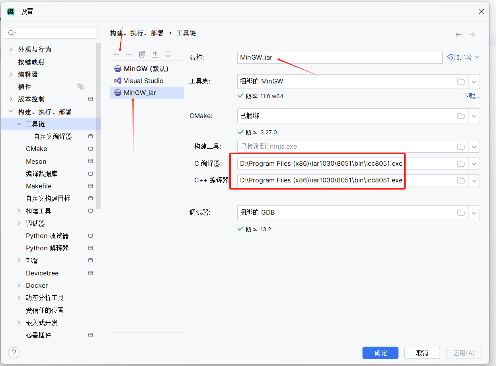
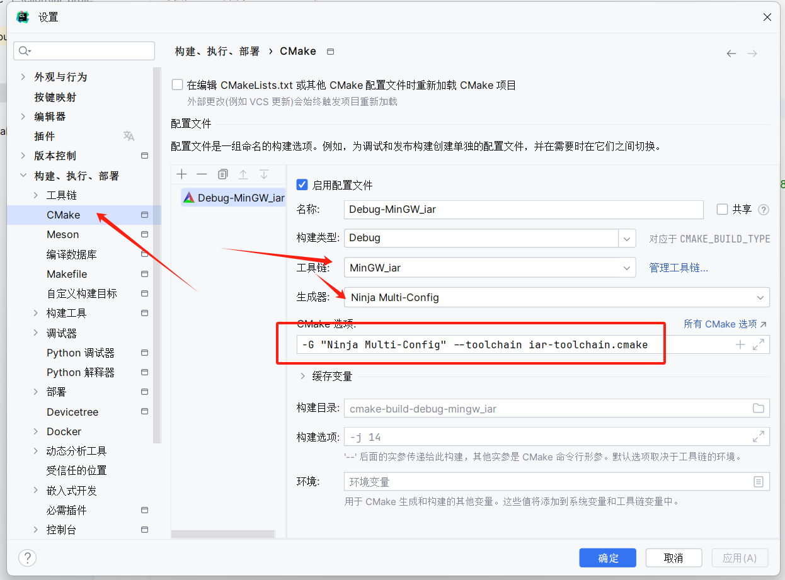

<!-- TOC -->
* [使用cmake开发iar 8051工程](#使用cmake开发iar-8051工程)
  * [配置步骤](#配置步骤)
  * [目录说明](#目录说明)
* [参考文档](#参考文档)
<!-- TOC -->

# 使用cmake开发iar 8051工程

| 其他架构同理, 也可参考iar官方cmake教程 [goto 参考文档](#参考文档)

## 配置步骤

1. 新建一个基于cmake的空项目
2. 添加自定义工具链, 
3. 配置cmake编译选项: `-G "Ninja Multi-Config" --toolchain iar-toolchain.cmake` 
4. 修改iar-toolchain.cmake文件中的iar安装路径, 例如`set(TOOLKIT "D:/Program Files (x86)/iar1030/8051")`
5. 添加新的your_project_dir文件夹, 在根目录的CMakeLists.txt中添加`add_subdirectory(your_project_dir)`
6. 在your_project_dir文件夹中添加CMakeLists.txt, 参考template的cmake文件, **注意修改cmake文件编译类型和烧录软件的路径**
7. 刷新根目录的cmake, 开始编译即可
8. 编译好的文件在`cmake-build-*/your_project_dir/*/*.hex`
9. 烧录该文件即可

## 目录说明

- 8051: 官方cmake教程的8051工程
- CC2530DB_CONFIG: 复制于Z-stack install dir/Projects/zstack/Tools/CC2530DB, 便于修改zstack项目的配置
- template: 基础cc2530工程, 用于快速创建新的工程
- Z-Stack-template: 基于template的zstack工程, 用于快速创建新的zstack工程,  **对应设备COORDINATOR, ROUTER,
  ENDDEVICE需要修改内部cmake对应TODO位置的内容**

# 参考文档

[官方iar cmake教程](https://github.com/IARSystems/cmake-tutorial/blob/master/README.md)

[xlink options](resources/xlink_ENU.pdf)

[8051_CompilerGuide options](https://wwwfiles.iar.com/8051/webic/doc/EW8051_CompilerGuide.pdf)